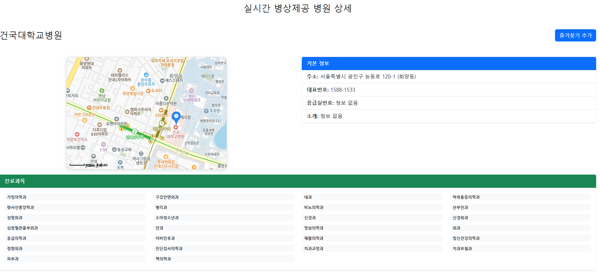
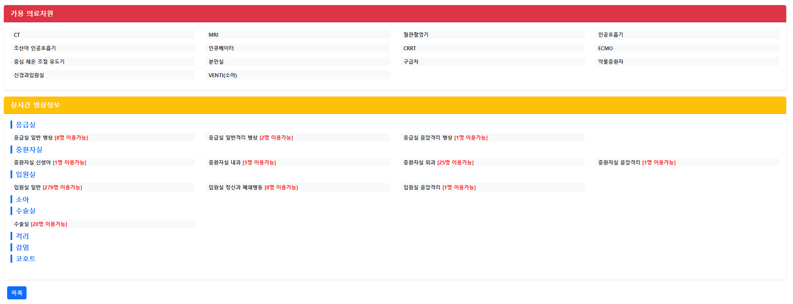
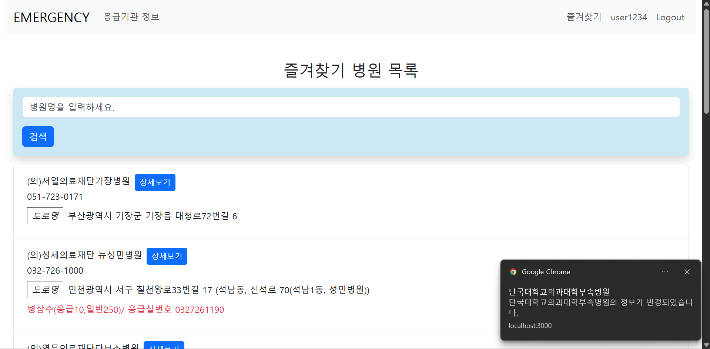

# 🚨 Emergency-Project

## 📖 프로젝트 소개
- 응급실을 이용하고자 하는 사람들에게 실시간 병상 정보를 제공하고자 하여 만들게 된 프로젝트입니다.
- 응급실 / 입원실을 운영하는 병원 정보 리스트를 조회할 수 있으며, 진료과목, 가용 의료자원, 실시간 병상정보를 디테일 페이지에서 확인할 수 있습니다.
- 로그인 후 특정 병원을 즐겨찾기 시 FCM 알림으로 갱신 알림을 받아볼 수 있습니다.

## 🛠 기술 스택
### Frontend
- React, React Router, React-Bootstrap, Axios
### Backend
- Spring BOOT / MySQL
- Spring Security, JWT, MyBatis, MySQL, Spring Batch, Kafka, Firebase Admin SDK (FCM)

## 💻 프로젝트 화면






## 📌 프로젝트 요약

https://www.data.go.kr/tcs/dss/selectApiDataDetailView.do?publicDataPk=15000563

공공데이터포털에서 제공하는 전국 응급의료기관 정보 API를 활용한 웹사이트입니다.

- 사용자에게 실시간에 가깝게 정보를 제공해 주기 위하여 해당 API를 스프링 배치 + 스케쥴러를 활용하여 1분 주기로 DB에 업데이트하여 최신정보를 유지
- JWT를 활용한 인증, 인가
- 유저는 즐겨찾기한 병원에 대한 알림을 받을 수 있음. (비동기 처리, 안정적인 이벤트 전송을 위해 Kafka를 선택)
  1. 배치의 Writer 내부에서 이벤트를 발행하여 해당 이벤트는 카프카 토픽에 메시지 발행
  2. 카프카 Consumer가 FCM 토큰을 가지고 있는 유저에게 알림 전송

## 🔧 트러블슈팅

### 1. 쿠키 저장 문제
- **문제:** 로그인 시 `Set-Cookie`가 네트워크에는 보이지만 브라우저 Cookie에 저장되지 않음  
- **해결:** Axios 요청에 `withCredentials: true` 추가

### 2. Authorization 헤더 읽기 불가
- **문제:** `response.headers['authorization']` 값을 클라이언트에서 읽을 수 없음  
- **해결:** 서버 CORS 필터에 `.addExposedHeader("Authorization")` 추가

### 3. SERVICE KEY 인코딩 문제
- **문제:** WebClient 사용 시 `service key`가 자동 인코딩되어 오류 발생  
- **해결:** `DefaultUriBuilderFactory` 생성 후 인코딩 모드 `NONE`/`VALUES_ONLY` 적용

### 4. XML/JSON 매핑 우선순위 문제
- **문제:** XMLMapper 사용 시 컨트롤러 응답이 XML로만 반환  
- **해결:** ObjectMapper가 우선시되도록 설정 수정

### 5. Axios 인터셉터 Authorization 누락
- **문제:** `originalRequest.headers.Authorization` 설정 시 토큰 미반영  
- **해결:** `originalRequest.headers['authorization']` 로 수정


## 🚀 로컬 Kafka 환경 (도커 사용)

```yml
version: '3.8'

services:
  zookeeper:
    image: confluentinc/cp-zookeeper:7.4.1
    ports:
      - "2181:2181"
    environment:
      ZOOKEEPER_CLIENT_PORT: 2181
      ZOOKEEPER_TICK_TIME: 2000

  kafka:
    image: confluentinc/cp-kafka:7.4.1
    depends_on:
      - zookeeper
    ports:
      - "9092:9092"
    environment:
      KAFKA_BROKER_ID: 1
      KAFKA_ZOOKEEPER_CONNECT: 'zookeeper:2181'
      KAFKA_ADVERTISED_LISTENERS: PLAINTEXT://localhost:9092
      KAFKA_LISTENERS: PLAINTEXT://0.0.0.0:9092
      KAFKA_OFFSETS_TOPIC_REPLICATION_FACTOR: 1
      KAFKA_TRANSACTION_STATE_LOG_MIN_ISR: 1
      KAFKA_TRANSACTION_STATE_LOG_REPLICATION_FACTOR: 1
```
