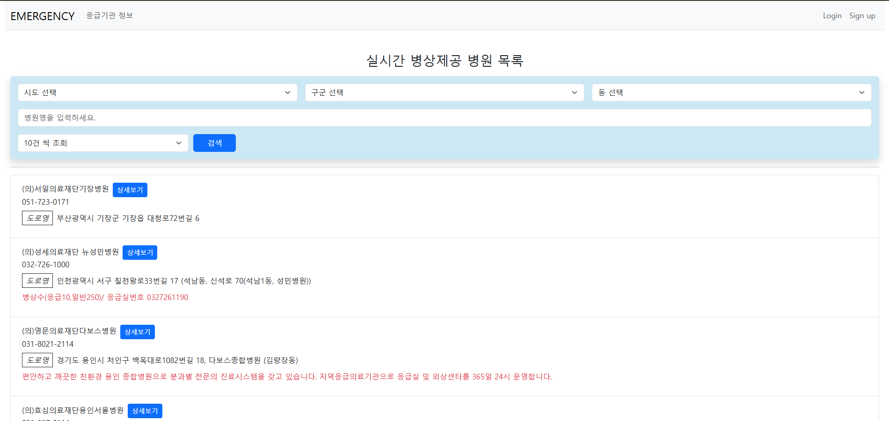
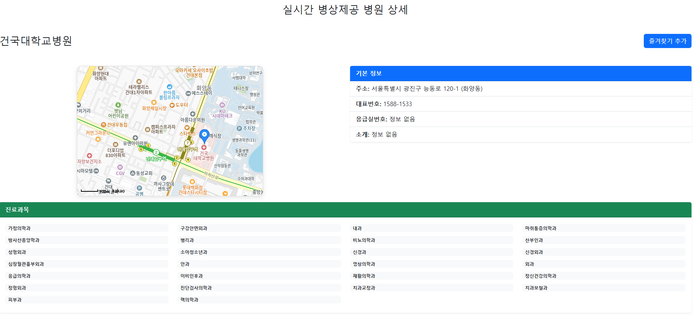
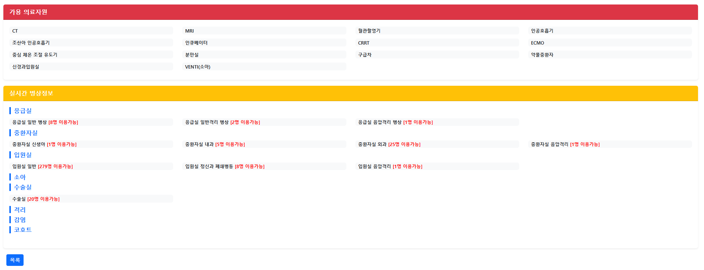
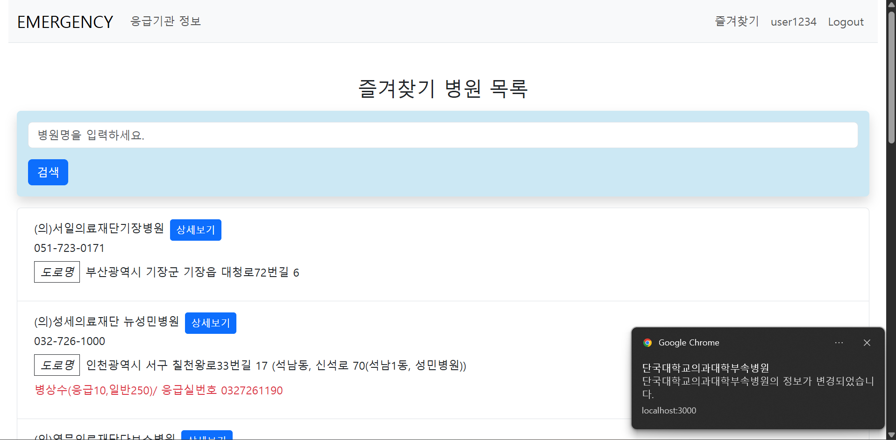

# EMERGENCY : 실시간 응급실 가용 병상 알림 서비스

### 프로젝트 개요
전국 응급실 및 입원실 가용 병상 정보를 2분 주기로 수집하고, 병상 수 변동 시 관심 병원을 등록한 유저에게 즉각적인 FCM 푸시 알림을 제공하는 웹 서비스입니다. 
대규모 데이터 갱신(메인 비즈니스)과 알림 발송(외부 연동) 과정에서 발생할 수 있는 병목 현상을 해소하고, 데이터 정합성을 보장하는 데 집중했습니다.

### 개발 환경
- **Backend:** Java 21, Spring Boot 3.x, MyBatis
- **Data Pipeline:** Spring Batch, Spring Scheduler
- **Message Queue:** Apache Kafka
- **Database:** MySQL
- **Notification:** Firebase Admin SDK (FCM)

---

### 주요 성능 개선 및 트러블슈팅 요약
> 상세한 기술적 의사결정 과정, 트러블슈팅, 코드가 포함된 문서는 **[상세 포트폴리오 문서([PDF/Notion 링크](https://www.notion.so/Emergency-Project-32f3e1e2779f80dcae38e1b5f6f340b1?source=copy_link))]**에서 확인하실 수 있습니다.

- **Spring Batch 대규모 데이터 처리 최적화 (수행 시간 8초 → 2초 단축)**
  - 단순 List 처리 방식에서 Chunk-oriented(단일 객체) 구조로 아키텍처를 개편하고 API 호출 단위를 최적화하여 네트워크 및 메모리 오버헤드를 대폭 축소했습니다.
- **Kafka를 활용한 시스템 결합도 분리 및 지연 시간 20% 개선**
  - Spring Event를 활용해 DB 업데이트와 알림 발송 트랜잭션을 물리적으로 분리하고, Producer 설정을 단일 브로커 환경에 맞게 튜닝하여 처리 속도를 높였습니다.
- **Transactional Outbox Pattern을 통한 정합성 100% 보장**
  - 브로커 장애 시 발생할 수 있는 메시지 유실을 막기 위해 Outbox 테이블을 도입했습니다. 낙관적 락(Optimistic Lock)과 UPSERT 쿼리를 결합한 복구 스케줄러를 구현하여 동시성 경합 없이 안전하게 실패 건을 처리합니다.
- **외부 인프라 의존성을 격리한 테스트 환경 구축**
  - 실제 Kafka 환경 없이도 비동기 콜백 상태 동기화, Consumer 멱등성, 대용량 청크 분할 발송을 검증할 수 있도록 통합 테스트 코드를 작성하여 안정성을 증명했습니다.
- **대용량 조회를 고려한 쿼리 튜닝 및 리팩토링**
  - OFFSET 기반 페이징의 풀 스캔 문제를 커서(Cursor) 기반으로 개편하고, 불필요한 트랜잭션 제거 및 예외 처리 규격화 등 전반적인 코드 품질을 개선했습니다.

---

### 시스템 파이프라인 흐름
데이터의 최신성 유지와 알림 발송의 안정성을 위해 아래와 같이 파이프라인을 구축했습니다.

1. **데이터 수집:** `Scheduler(2분 주기)` → 공공데이터 API 호출 → DB 일괄 업데이트 (Bulk)
2. **변동 감지:** 병상 수 변동 데이터 선별 → DB 트랜잭션 커밋 직후 `Spring Event` 발행
3. **비동기 분리:** 이벤트 핸들러 → `Kafka` 알림 Topic 전송 (시스템 간 물리적 격리)
4. **실시간 알림:** `Kafka Consumer` → 대상 유저 선별 → `FCM` 푸시 알림 전송

---

## 💻 프로젝트 화면

