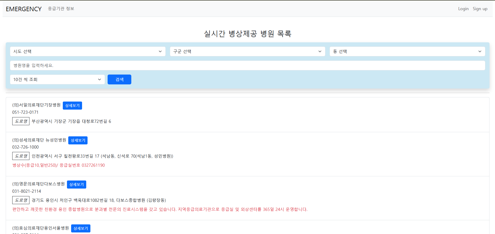

# 🚨 Emergency-Project

## 📖 프로젝트 소개
- 응급실을 이용하고자 하는 사람들에게 실시간 병상 정보를 제공하고자 하여 만들게 된 프로젝트입니다.
- 응급실 / 입원실을 운영하는 병원 정보 리스트를 조회할 수 있으며, 진료과목, 가용 의료자원, 실시간 병상정보를 디테일 페이지에서 확인할 수 있습니다.
- 로그인 후 특정 병원을 즐겨찾기 시 FCM 알림으로 갱신 알림을 받아볼 수 있습니다.

## 🛠 주요 기술
### Backend
- Spring Batch, Kafka, Firebase Admin SDK (FCM)

## 💻 프로젝트 화면




## 📌 프로젝트 핵심 요약

공공데이터포털에서 제공하는 전국 응급의료기관 정보 API를 활용한 웹사이트입니다.

- 사용자에게 실시간에 가깝게 정보를 제공해 주기 위하여 해당 API를 스프링 배치 + 스케쥴러를 활용하여 2분 주기로 DB에 업데이트하여 해당 정보 기반으로 한 조회 페이지 구성
- 유저는 즐겨찾기한 병원에 대한 알림을 받을 수 있음. (스프링 배치로 인한 DB업데이트와의 독립적 구성, 비동기 처리, 안정적인 메시지 전송을 위해 Kafka를 선택)
  1. 배치의 Writer 업데이트 된 병원 리스트를 추려 해당 리스트를 담은 이벤트를 발행
  2. 이벤트핸들러를 활용하여 커밋 이후 카프카 Producer 알림 전송 토픽 send() 처리
  3. 카프카 Consumer가 DB 정보에 FCM 토큰이 유효한 유저에게 FCM 알림 전송

## 🚀 로컬 Kafka 환경 (도커 사용)

```yml
version: '3.8'

services:
  zookeeper:
    image: confluentinc/cp-zookeeper:7.4.1
    ports:
      - "2181:2181"
    environment:
      ZOOKEEPER_CLIENT_PORT: 2181
      ZOOKEEPER_TICK_TIME: 2000

  kafka:
    image: confluentinc/cp-kafka:7.4.1
    depends_on:
      - zookeeper
    ports:
      - "9092:9092"
    environment:
      KAFKA_BROKER_ID: 1
      KAFKA_ZOOKEEPER_CONNECT: 'zookeeper:2181'
      KAFKA_ADVERTISED_LISTENERS: PLAINTEXT://localhost:9092
      KAFKA_LISTENERS: PLAINTEXT://0.0.0.0:9092
      KAFKA_OFFSETS_TOPIC_REPLICATION_FACTOR: 1
      KAFKA_TRANSACTION_STATE_LOG_MIN_ISR: 1
      KAFKA_TRANSACTION_STATE_LOG_REPLICATION_FACTOR: 1
```
